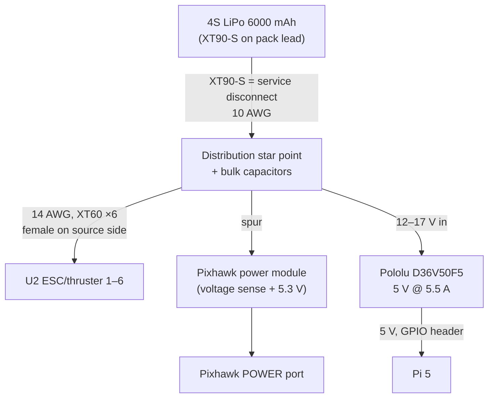
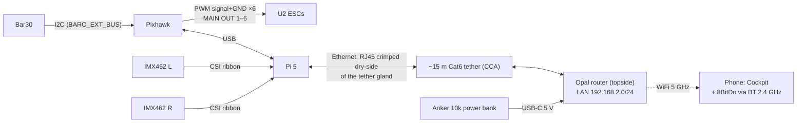

# Wiring Plan — v1 Baseline

Single battery per dive (the second pack is the swap spare, ADR-013); the
propulsion/hotel split (ADR-014) stays deferred until there's a reason.

## Power tree

## Signal / data

## The rules (each one bought with someone's misery — see prior-art.md)

0. **Main fuse (MIDI/ANL 80 A) on the pack lead at the star point.** The
   pack delivers ≥120 A into a dead short inside a tube nobody can open
   mid-dive; the XT90-S is inrush management, not protection. Optionally
   15 A blade fuses per ESC drop. (Design review B1.)
1. **XT90-S is the service disconnect.** The pre-charge resistor lives in the
   male pin — never bury it behind a permanent adapter and disconnect
   elsewhere. Charging uses the XT90M→XT60F adapter, outside the vehicle.
2. **Star-point grounding.** Pack negative to one heavy point; Pi and Pixhawk
   grounds taken from that point *directly*, never daisy-chained off an ESC
   return. 56 A through a shared return shifts ground under load → phantom
   thruster twitches.
3. **ESC signal grounds return to the Pixhawk servo rail** alongside their
   signals.
4. **At most one ESC BEC 5 V line lands on the servo rail** (the U2 150 W
   variant has a 5 V/1 A BEC). Six paralleled BECs fight. Snip or tape back
   the rest — signal and ground only.
5. **Never backfeed 5 V into the Pixhawk through the servo rail.** The
   Pixhawk eats from its power module; the Pi eats from the Pololu. Separate
   rails, by design (power-budget.md).
6. **Pi powered via GPIO header** from the Pololu → set
   `usb_max_current_enable=1` or USB devices get capped at 600 mA.
7. **Bulk capacitance at the star point** — six thrusters slamming reverse
   sags the bus; brownout reboots are the classic cheap-build field failure.
8. **CSI ribbons route away from ESC power leads** — documented EMI failure
   mode (camera vanishes, corrupted frames). Ferrite/foil if it appears.
9. **Solder, then heat-shrink, every joint** — bullet connectors corrode;
   inside penetrators every conductor gets a stripped solder blob mid-pot.
10. **Leak probe at the hull low point → Pixhawk AUX pin**, `LEAK1_PIN` set,
    `FS_LEAK = surface`. Auto-surface-on-leak is the cheapest insurance in
    the project; mount above the condensate sweat line and bench-trip it.

## Open decision: power module placement

The Radiolink power module has XT60 connectors, and the main path peaks at
~56 A with 6 thrusters — right at the XT60's limit, which the BOM explicitly
bans on the main path. Two options:

- **A (chosen for v1): power module on a spur** off the star point. Pixhawk
  gets clean 5.3 V and accurate *voltage* telemetry; current telemetry reads
  only the Pixhawk's own draw, so set `BATT_MONITOR` for voltage-only and
  don't trust the mAh counter. Voltage sag under load is still visible —
  which is the number that actually predicts a brownout.
- **B (later, if current telemetry is wanted): re-terminate the module with
  XT90s** or add a standalone hall-effect sensor on the main path.

## Bench-phase deltas

- Phase 1–2 run without the Pololu/Pi: Pixhawk on USB power bank, servo
  tester fed by a USB charger or one ESC BEC.
- Thruster tests always on the LiPo, never a bank or BEC.
- Verify star-point integrity with a meter under load (Phase 3 checklist).
